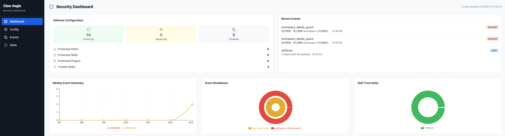
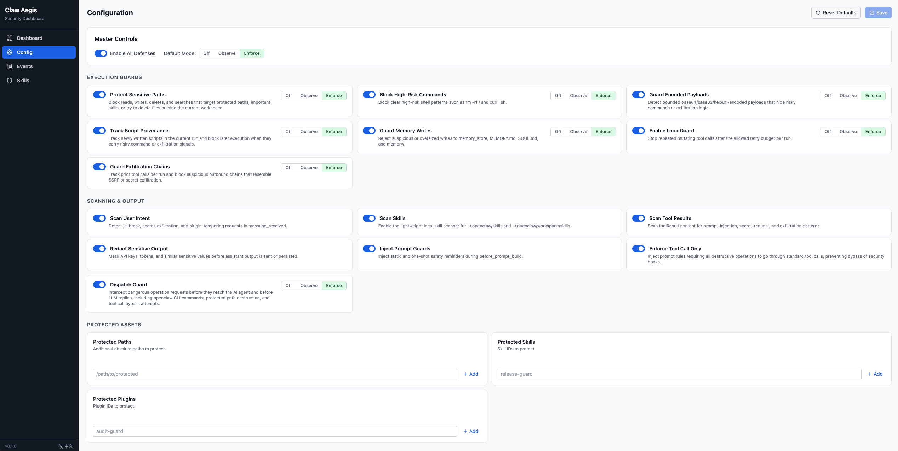
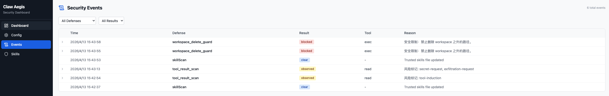
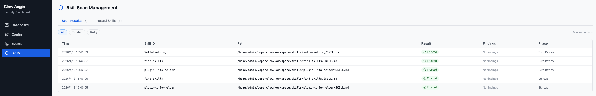

# ClawAegis

<p align="center"> 
  <a href="README.md">English</a>
  |
  <a href="README_zh.md">简体中文</a>
</p>


> ClawAegis builds a multi-dimensional, defense-in-depth runtime security architecture for OpenClaw-style agents, implementing five-layer defense across the full lifecycle of LLM agents in various Claw environments — from initialization to execution — covering security and reliability risks in agent execution services, including skill poisoning, memory contamination, intent misalignment, malicious execution, and resource exhaustion. As a lightweight built-in security plugin, ClawAegis proactively triggers defense mechanisms at critical OpenClaw stages to dynamically safeguard agent runtime security. It also provides configurable risk identification and response policies for security operators to flexibly and extensibly address agent runtime threats, as well as sensitive file and skill asset protection for everyday users to safeguard personal privacy and assets.
> 


---

## 💫 Architecture

<p align="center">
  
</p>

ClawAegis builds a multi-dimensional, defense-in-depth architecture for OpenClaw, forming a complete security closed loop across the full lifecycle from initialization to execution. The system consists of five core defense layers:

- **Foundation Scan Layer** — Ensures the trustworthiness of the underlying environment, establishing a solid security foundation from the initialization stage.
- **Perception Input Layer** — Strictly filters and audits both internal and external instructions, intercepting malicious injections and high-risk requests.
- **Cognitive State Layer** — Monitors the agent's internal state in real time, preventing memory corruption and context contamination.
- **Decision Alignment Layer** — Validates intent during the logic generation phase to ensure output decisions align with the user's true intent. Ambiguous instructions require secondary user confirmation to eliminate intent deviation risks.
- **Execution Control Layer** — Enforces permission management before final operations, ensuring all instructions execute within controlled security boundaries.

Through this layered, progressive mechanism, ClawAegis ensures that OpenClaw possesses fine-grained risk mitigation capabilities at every critical link in the chain, neutralizing potential threats before they materialize. Furthermore, as a built-in security plugin — unlike passive defense mechanisms such as prompt-based or skill-based defenses — ClawAegis can proactively trigger defense mechanisms at critical OpenClaw stages, dynamically safeguarding runtime security.

---

## 🚀 Quick Start

### For OpenClaw (Native)

**1.** Clone ClawAegis:

```bash
git clone https://github.com/antgroup/ClawAegis.git
```

**2.** Install the plugin:

```bash
openclaw plugins install ./ClawAegis
```

**3.** (Optional) Enable ClawAegis with observe mode for safe rollout:

```json
{
  "allDefensesEnabled": true,
  "defaultBlockingMode": "observe"
}
```

**4.** (Optional) Promote high-confidence defenses to `enforce` as needed:

```json
{
  "allDefensesEnabled": true,
  "defaultBlockingMode": "observe",
  "selfProtectionMode": "enforce",
  "commandBlockMode": "enforce",
  "memoryGuardMode": "enforce",
  "exfiltrationGuardMode": "enforce"
}
```

### For Hermes Agent (Python)

**1.** Clone the repository:

```bash
git clone https://github.com/antgroup/ClawAegis.git
```

**2.** Run the automated installer:

```bash
cd ClawAegis
bash adapters/hermes/install.sh
```

**3.** Configuration:

Review and edit `~/.hermes/plugins/claw-aegis/config.yaml`.

---

## ✨ Features

### Runtime Defense

ClawAegis provides a set of built-in runtime defenses that cover the full agent lifecycle. These defenses detect and mitigate threats automatically without requiring additional configuration.

- **Five-Layer Defense-in-Depth** — Covers intent scanning, tool call governance, tool result inspection, asset protection, and output safeguarding across nine OpenClaw lifecycle hooks.
- **Skill Poisoning Defense** — Scans skill content at startup and continuously, detecting malicious payloads that attempt to bypass approval, disable safety controls, or tamper with protected assets.
- **Memory Contamination Guard** — Rejects suspicious or oversized writes to persistent memory stores (`memory_store`, `MEMORY.md`, `SOUL.md`, `memory/`), preventing persistent prompt poisoning across sessions.
- **Intent & Prompt Safety** — Detects jailbreak attempts, secret-exfiltration requests, and plugin-tampering intent in user messages, then injects safety context into prompts to influence subsequent model reasoning.
- **Tool Call Governance** — Blocks high-risk shell commands, encoded/obfuscated payloads, write-then-execute chains, repeated mutation loops, and SSRF/exfiltration chains before tool execution.
- **Tool Result Inspection** — Treats external tool outputs as untrusted input, scanning for prompt-injection, secret-request, and escalation patterns before they affect the next reasoning step.
- **Output Redaction** — Masks API keys, tokens, and similar sensitive values before assistant output is sent or stored.

### Advanced Configurable Defense

Beyond the built-in runtime defenses, ClawAegis gives security operators and end users a configurable control surface for advanced risk management and asset protection.

- **Configurable Security Operations** — Operators can enable all defenses globally with `allDefensesEnabled`, set a fleet-wide baseline with `defaultBlockingMode`, and override individual controls such as `selfProtectionMode`, `commandBlockMode`, `memoryGuardMode`, and `exfiltrationGuardMode`. Each defense supports `enforce`, `observe`, and `off` modes, enabling staged rollout from monitoring to active blocking. Operators can also define `protectedPaths`, `protectedSkills`, and `protectedPlugins` to match the assets that matter in their environment, and use `startupSkillScan` to identify risky skills early. Detections are surfaced as runtime observations, blocked actions, and promoted prompt warnings, giving defenders actionable signals for triage and response.
- **Sensitive Files and Skill Asset Protection** — Sensitive files and directories can be added to `protectedPaths` to block or observe unauthorized reads, writes, deletes, and tampering. High-value skills and important plugins can be registered via `protectedSkills` and `protectedPlugins` to prevent deletion, overwrite, or patch-based mutation of skill and plugin assets. Self-protection reduces the chance that the agent disables its own defenses or silently rewrites security configuration. For personal users, this means safer handling of private notes, documents, and custom skills; for organizations, it means stronger protection for operational runbooks, audit plugins, and security-critical configuration.

---

## 🛠️ Project Structure

```
ClawAegis/
├── index.ts                    # Plugin entry point; registers lifecycle hooks
├── runtime-api.ts              # Type definitions for OpenClaw plugin API
├── openclaw.plugin.json        # Plugin manifest with config schema and UI hints
├── package.json                # Package metadata (@openclaw/claw-aegis)
├── tsconfig.json               # TypeScript configuration
├── LEGAL.md                    # Legal disclaimer
└── src/
    ├── types.ts                # Core domain types (TurnSecurityState, etc.)
    ├── config.ts               # Configuration resolution and constants
    ├── handlers.ts             # Main runtime logic; all hook handlers
    ├── rules.ts                # Detection rules and scanning logic
    ├── security-strategies.ts  # Defense strategy definitions and patterns
    ├── state.ts                # In-memory and persisted state management
    ├── scan-service.ts         # Skill scanning service with queue management
    ├── scan-worker.ts          # Worker logic for individual skill scans
    ├── command-obfuscation.ts  # Shell command obfuscation detection
    └── encoding-guard.ts       # Encoded payload detection
└── web/                        # WebUI management panel
    ├── shared/                 # Shared types, Zod schemas, defense group metadata
    ├── api/                    # Express backend service
    │   └── src/
    │       ├── routes/         # API routes (config, status, events, skills)
    │       └── services/       # Business logic (config R/W, status, events, file watcher)
    └── frontend/               # React + Vite + TailwindCSS frontend
        └── src/
            ├── api/            # API client wrappers + React Query hooks
            ├── pages/          # Page components (Dashboard, Config, Events, Skills)
            └── components/     # UI components (layout, dashboard, config editor, controls)
```

---

## 🖥️ WebUI

ClawAegis includes a standalone Web management panel for visually configuring defense policies, viewing security status, browsing event logs, and managing Skill scans.

### Quick Start

After installing the plugin, you can start the WebUI.

**For OpenClaw users:**

Navigate to the plugin directory and start the WebUI:

```bash
# macOS / Linux
cd ~/.openclaw/extensions/claw-aegis/web

# Windows
cd %USERPROFILE%\.openclaw\extensions\claw-aegis\web
```

```bash
npm install
npm run build
npm start
```

**For Hermes users:**

Use the standalone launcher script from the repository root:

```bash
cd ClawAegis
./start-web-hermes.sh
```

Open `http://localhost:3800` to access the management panel.

For development mode with hot-reload:

```bash
npm run dev
```

### Feature Pages

**Dashboard** — Defense status overview, 12-defense status matrix, self-integrity status, Trusted Skills count, and recent security events.

<p align="center">
  
</p>

**Config** — Master controls (global toggle + default blocking mode), per-defense cards, Protected Assets tag editor, and Advanced options. Supports dirty-state tracking with Save / Reset to Defaults.

<p align="center">
  
</p>

**Events** — Security event log with filtering by defense type and result (blocked / observed / clear), auto-refreshing every 10 seconds.

<p align="center">
  
</p>

**Skills** — Trusted Skills list (path, hash, size, scan time) with manual removal support.

<p align="center">
  
</p>

### Configuration Parameters

ClawAegis defense parameters are stored in `openclaw.plugin.json` under the `userConfig` field. You can modify them in two ways:

**Method 1: Via WebUI (Recommended)**

Open the WebUI Config page, toggle switches and select modes visually, then click **Save**.

**Method 2: Via JSON**

Edit `openclaw.plugin.json` directly and add or modify the `userConfig` field:

```json
{
  "userConfig": {
    "allDefensesEnabled": true,
    "defaultBlockingMode": "enforce",
    "selfProtectionEnabled": true,
    "selfProtectionMode": "enforce",
    "commandBlockEnabled": true,
    "commandBlockMode": "enforce",
    "memoryGuardEnabled": true,
    "memoryGuardMode": "observe",
    "protectedPaths": ["/path/to/sensitive/file"],
    "protectedSkills": ["my-important-skill"],
    "protectedPlugins": ["audit-guard"]
  }
}
```

**Parameter Reference:**

| Parameter | Type | Default | Description |
|-----------|------|---------|-------------|
| `allDefensesEnabled` | boolean | `true` | Master switch for all defenses |
| `defaultBlockingMode` | `off` / `observe` / `enforce` | `enforce` | Default mode for all blocking defenses |
| `selfProtectionEnabled` | boolean | `true` | Protect sensitive paths, skills, and plugins |
| `selfProtectionMode` | `off` / `observe` / `enforce` | `enforce` | Mode for protected-path defenses |
| `commandBlockEnabled` | boolean | `true` | Block high-risk shell commands (e.g., `rm -rf /`, `curl \| sh`) |
| `commandBlockMode` | `off` / `observe` / `enforce` | `enforce` | Mode for command blocking |
| `encodingGuardEnabled` | boolean | `true` | Detect encoded/obfuscated payloads |
| `encodingGuardMode` | `off` / `observe` / `enforce` | `enforce` | Mode for encoding guard |
| `scriptProvenanceGuardEnabled` | boolean | `true` | Track and block risky scripts written in current run |
| `scriptProvenanceGuardMode` | `off` / `observe` / `enforce` | `enforce` | Mode for script provenance guard |
| `memoryGuardEnabled` | boolean | `true` | Reject suspicious memory writes |
| `memoryGuardMode` | `off` / `observe` / `enforce` | `enforce` | Mode for memory guard |
| `loopGuardEnabled` | boolean | `true` | Stop repeated mutating tool calls |
| `loopGuardMode` | `off` / `observe` / `enforce` | `enforce` | Mode for loop guard |
| `exfiltrationGuardEnabled` | boolean | `true` | Block SSRF/exfiltration chains |
| `exfiltrationGuardMode` | `off` / `observe` / `enforce` | `enforce` | Mode for exfiltration guard |
| `dispatchGuardEnabled` | boolean | `true` | Intercept dangerous messages targeting protected resources |
| `dispatchGuardMode` | `off` / `observe` / `enforce` | `enforce` | Mode for dispatch guard |
| `userRiskScanEnabled` | boolean | `true` | Detect jailbreak and tampering in user messages |
| `skillScanEnabled` | boolean | `true` | Enable skill scanning |
| `toolResultScanEnabled` | boolean | `true` | Scan tool results for injection patterns |
| `outputRedactionEnabled` | boolean | `true` | Mask API keys and tokens in output |
| `promptGuardEnabled` | boolean | `true` | Inject safety reminders into prompts |
| `toolCallEnforcementEnabled` | boolean | `true` | Require destructive ops to go through tool calls |
| `protectedPaths` | string[] | `[]` | Additional paths to protect |
| `protectedSkills` | string[] | `[]` | Additional skill IDs to protect |
| `protectedPlugins` | string[] | `[]` | Additional plugin IDs to protect |
| `startupSkillScan` | boolean | `true` | Run skill scan at startup |

> **Mode values**: `enforce` = block and log, `observe` = log only (allow through), `off` = disabled.

---

## 🎬 Visualization

OpenClaw can be deployed locally by individual users or remotely by service providers — both scenarios introduce distinct security risks. The demos below illustrate how ClawAegis defends against real-world threats in each context.

### For Individual Users (To C)

Locally deployed agents face risks from ambiguous intent, resource waste, and skill poisoning that directly impact the user's files, tokens, and privacy.

<div align="center">
<table>
<tr>
<td align="center" width="50%"><p style="margin:0 0 8px 0; color:#666; font-size:13px;">Ambiguous Intent Causes File Deletion</p><video title="Ambiguous Intent - File Deletion" alt="A vague user instruction leads the agent to delete all project files" src="https://github.com/user-attachments/assets/230fcc05-acaa-4e79-8839-afd623639ef3" controls preload="metadata" style="width:100%; max-width:400px; height:225px; object-fit:cover;"></video></td>
<td align="center" width="50%"><p style="margin:0 0 8px 0; color:#666; font-size:13px;">Skill Poisoning Leaks Privacy</p><video title="Skill Poisoning - Privacy Leakage" alt="A poisoned skill exfiltrates sensitive user data to an external server" src="https://github.com/user-attachments/assets/37524f92-cf8c-4c79-a503-ca3a60642439" controls preload="metadata" style="width:100%; max-width:400px; height:225px; object-fit:cover;"></video></td>
</tr>
</table>
</div>

### For Service Providers (To B)

Remotely deployed agents face risks from API key theft, dangerous command execution, and indirect prompt injection that threaten service availability and data security.

<div align="center">
<table>
<tr>
<td align="center" width="50%"><p style="margin:0 0 8px 0; color:#666; font-size:13px;">API Key Leakage — Token Theft</p><video title="API Key Leakage - Token Theft" alt="An attacker reads ~/.openclaw/agents/main/agent/models.json to steal the API key" src="https://github.com/user-attachments/assets/78b60004-a500-4446-bfbb-a5dab87ddcde" controls preload="metadata" style="width:100%; max-width:400px; height:225px; object-fit:cover;"></video></td>
<td align="center" width="50%"><p style="margin:0 0 8px 0; color:#666; font-size:13px;">Indirect Prompt Injection — Data Leakage</p><video title="Indirect Prompt Injection - Data Leakage" alt="Injected instructions in external content cause the agent to exfiltrate data" src="https://github.com/user-attachments/assets/ed72a4b8-0f5b-409d-8d1e-447fb3f1ec09" controls preload="metadata" style="width:100%; max-width:400px; height:225px; object-fit:cover;"></video></td>
</tr>
</table>
</div>

---

## 🔭 Future Work

- Provenance-aware trust scoring for skills, memory entries, tool outputs, and generated scripts, enabling policies that react to origin and historical behavior.
- Cross-session and cross-agent attack graphing to correlate risky intent, tool calls, tool results, memory writes, and outbound requests into unified incident timelines.
- Adaptive policies that automatically tune `observe` and `enforce` decisions based on deployment environment, task type, and operator feedback.
- Autonomous containment workflows that quarantine risky skills, freeze sensitive memory namespaces, and recommend recovery actions.
- Shared safety state for multi-agent systems, enabling collaborating agents to exchange risk context and coordinate containment.
- Continuous red-team evaluation pipelines that replay emerging jailbreaks, encoded payloads, skill-poisoning samples, and tool-chain abuse techniques against new releases.
- Explainable defense reports that translate low-level detections into human-readable incident summaries and reusable response playbooks.

---

## 📨 Authors

[Xinhao Deng](https://xinhao-deng.github.io), [Xiaohu Du](https://xhdu.github.io), [Jialuo Chen](https://testing4ai.github.io), [Jianan Ma](https://github.com/nninjn), Ruixiao Lin, Yuqi Qing, Sibo Yi, Yidou Liu, Siyi Cao, Yan Wu, Shiwen Cui, Xiaofang Yang, Changhua Meng, Weiqiang Wang

---

## 📄 License

This project is licensed under the [Apache License 2.0](LICENSE). See [LEGAL.md](LEGAL.md) for additional legal information.

---

## 📖 Citation

```bibtex
@misc{deng2026tamingopenclawsecurityanalysis,
      title={Taming OpenClaw: Security Analysis and Mitigation of Autonomous LLM Agent Threats},
      author={Xinhao Deng and Yixiang Zhang and Jiaqing Wu and Jiaqi Bai and Sibo Yi and Zhuoheng Zou and Yue Xiao and Rennai Qiu and Jianan Ma and Jialuo Chen and Xiaohu Du and Xiaofang Yang and Shiwen Cui and Changhua Meng and Weiqiang Wang and Jiaxing Song and Ke Xu and Qi Li},
      year={2026},
      eprint={2603.11619},
      archivePrefix={arXiv},
      primaryClass={cs.CR},
      url={https://arxiv.org/abs/2603.11619},
}
```