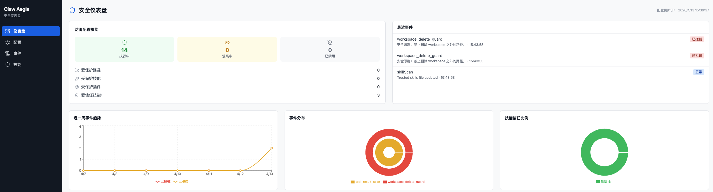
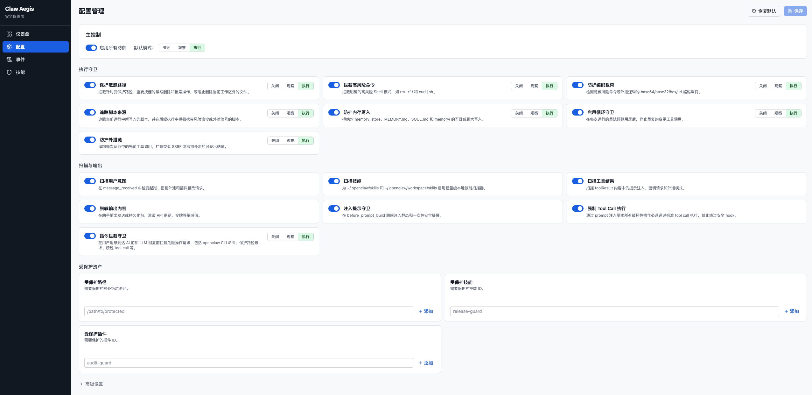
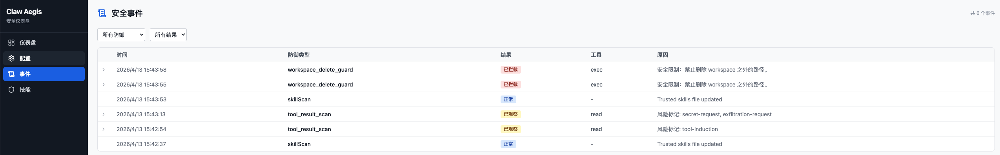
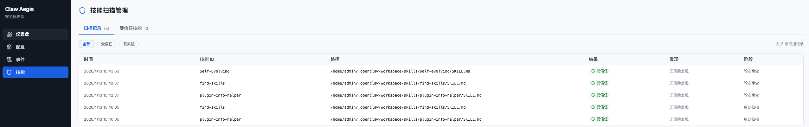

# AgentAegis
<p align="center"> 
  <a href="README.md">English</a>
  |
  <a href="README_zh.md">简体中文</a>
</p>


> AgentAegis为OpenClaw类智能体构建了一套多维度的智能体安全纵深防御架构，实现从大模型智能体在各种Claw从初始化到执行的全生命周期五层安全防御，覆盖智能体执行服务中的安全性和可靠性风险，包括skill投毒、记忆污染、意图对齐、恶意执行、资源耗尽等。作为内置的轻量化安全插件，AgentAegis可以在OpenClaw的关键阶段主动发起防御机制，动态保障智能体运行时的安全。此外，AgentAegis还面向安全运营人员提供风险识别与处置策略可配置能力，以灵活、可拓展地应对智能体运行时安全威胁；面向普通用户提供敏感文件及Skill资产保护能力，以保障个人隐私和资产安全。
> 


---

## 💫 架构

<p align="center">
  
</p>

AgentAegis 为 OpenClaw 构建了一套多维度的纵深防御架构，实现从初始化到执行终端的全生命周期安全闭环。该体系由以下五个核心防护层组成：

- **可信基座层防御** — 确保底层环境的可信度，从初始化阶段夯实系统安全根基。
- **感知输入层防御** — 对内部和外部指令进行严格过滤与审核，拦截恶意注入或高风险请求。
- **认知状态层防御** — 实时监控智能体的内部状态，防止记忆恶化上下文污染。
- **决策对齐层防御** — 在逻辑生成环节进行意图校验，确保输出决策与用户真实意图一致，模糊意图要求用户二次确认，消除意图偏离风险。
- **执行控制层防御** — 在最终操作前实施权限管理，确保所有指令都在安全边界内受控执行。

通过这种层层递进的机制，AgentAegis 确保了 OpenClaw 在每一个关键链路环节都具备细致的风险对冲能力，将潜在威胁消弭于无形。此外，作为内置的安全插件，不同于提示词、Skill类防御等被动防御机制，AgentAegis可以在OpenClaw的关键阶段主动发起防御机制，动态保障运行时的安全。

---

## 🚀 快速开始

**1.** 克隆 AgentAegis：

```bash
git clone https://github.com/antgroup/AgentAegis.git
```

**2.** 安装插件：

```bash
openclaw plugins install ./AgentAegis
```

**3.**（可选）以观察模式启用 AgentAegis，安全上线：

```json
{
  "allDefensesEnabled": true,
  "defaultBlockingMode": "observe"
}
```

**4.**（可选）根据需要将高置信度防御提升为 `enforce`：

```json
{
  "allDefensesEnabled": true,
  "defaultBlockingMode": "observe",
  "selfProtectionMode": "enforce",
  "commandBlockMode": "enforce",
  "memoryGuardMode": "enforce",
  "exfiltrationGuardMode": "enforce"
}
```

---

## ✨ 核心特性

### 运行时防御

AgentAegis 提供一组覆盖智能体全生命周期的内置运行时防御能力，无需额外配置即可自动检测和缓解威胁。

- **五层纵深防御** — 覆盖意图扫描、工具调用治理、工具结果审查、资产保护和输出安全，贯穿九个OpenClaw生命周期钩子。
- **Skill投毒防御** — 启动时及运行期间持续扫描Skill内容，检测试图绕过审批、禁用安全控制或篡改受保护资产的恶意载荷。
- **记忆污染防护** — 拒绝对持久化记忆存储（`memory_store`、`MEMORY.md`、`SOUL.md`、`memory/`）的可疑或超大写入，防止跨会话的持久化提示词投毒。
- **意图与提示词安全** — 检测用户消息中的越狱尝试、密钥窃取请求和插件篡改意图，并向提示词注入安全上下文以影响后续模型推理。
- **工具调用治理** — 在工具执行前拦截高危Shell命令、编码/混淆载荷、写后执行链、重复变异循环以及SSRF/数据泄露链。
- **工具结果审查** — 将外部工具输出视为不可信输入，扫描其中的提示词注入、密钥请求和权限提升模式，防止其影响下一步推理。
- **输出脱敏** — 在助手输出发送或存储前，遮蔽API密钥、令牌及类似敏感值。

### 进阶可配置防御

在内置运行时防御之上，AgentAegis 为安全运营人员和终端用户提供可配置的控制面，支持进阶风险管理和资产保护。

- **可配置安全运营** — 运营人员可通过 `allDefensesEnabled` 全局启用所有防御，通过 `defaultBlockingMode` 设置全局基线，并可逐项覆盖 `selfProtectionMode`、`commandBlockMode`、`memoryGuardMode`、`exfiltrationGuardMode` 等独立控制。每项防御均支持 `enforce`、`observe` 和 `off` 三种模式，实现从监控到主动拦截的渐进式部署。运营人员还可定义 `protectedPaths`、`protectedSkills` 和 `protectedPlugins` 来匹配其环境中的关键资产，并通过 `startupSkillScan` 提前识别风险Skill。检测结果以运行时观测、拦截动作和提升的提示词告警形式呈现，为防御者提供可操作的分类与响应信号。
- **敏感文件与Skill资产保护** — 敏感文件和目录可添加到 `protectedPaths`，对未授权的读取、写入、删除和篡改进行拦截或观测。高价值Skill和重要插件可通过 `protectedSkills` 和 `protectedPlugins` 注册，防止Skill和插件资产被删除、覆盖或补丁式篡改。自保护机制降低智能体关闭自身防御或静默改写安全配置的风险。对个人用户而言，这意味着私人笔记、文档和自定义Skill得到更安全的处理；对组织而言，这意味着运维手册、审计插件和安全关键配置获得更强的保护。

---

## 🛠️ 项目结构

```
AgentAegis/
├── index.ts                    # 插件入口；注册生命周期钩子
├── runtime-api.ts              # OpenClaw插件API类型定义
├── openclaw.plugin.json        # 插件清单，包含配置Schema和UI提示
├── package.json                # 包元数据（@openclaw/agent-aegis）
├── tsconfig.json               # TypeScript配置
├── LEGAL.md                    # 法律声明
└── src/
    ├── types.ts                # 核心领域类型（TurnSecurityState等）
    ├── config.ts               # 配置解析与常量
    ├── handlers.ts             # 主运行时逻辑；所有钩子处理器
    ├── rules.ts                # 检测规则与扫描逻辑
    ├── security-strategies.ts  # 防御策略定义与模式
    ├── state.ts                # 内存与持久化状态管理
    ├── scan-service.ts         # Skill扫描服务及队列管理
    ├── scan-worker.ts          # Skill扫描Worker逻辑
    ├── command-obfuscation.ts  # Shell命令混淆检测
    └── encoding-guard.ts       # 编码载荷检测
└── web/                        # WebUI管理面板
    ├── shared/                 # 前后端共享的类型定义、Zod校验schema、防御分组元数据
    ├── api/                    # Express后端服务
    │   └── src/
    │       ├── routes/         # API路由（config、status、events、skills）
    │       └── services/       # 业务逻辑（配置读写、状态读取、事件管理、文件监听）
    └── frontend/               # React + Vite + TailwindCSS前端
        └── src/
            ├── api/            # API客户端封装 + React Query hooks
            ├── pages/          # 页面组件（Dashboard、Config、Events、Skills）
            └── components/     # UI组件（布局、仪表盘、配置编辑器、通用控件）
```

---

## 🖥️ WebUI

AgentAegis 附带独立的 Web 管理面板，用于可视化配置防御策略、查看安全状态、浏览事件日志和管理 Skill 扫描。

### 快速开始

安装插件后，进入插件目录启动 WebUI：

```bash
# macOS / Linux
cd ~/.openclaw/extensions/agent-aegis/web

# Windows
cd %USERPROFILE%\.openclaw\extensions\agent-aegis\web
```

```bash
npm install
npm run build
npm start
```

启动后访问 `http://localhost:3800` 即可打开管理面板。

开发模式（支持热更新）：

```bash
npm run dev
```

### 安全与访问控制

管理 API 默认绑定 `127.0.0.1`（不对局域网/公网暴露），并通过 CORS 白名单仅放行本机浏览器 Origin。所有变更类请求（`PUT`/`POST`/`DELETE`）需携带 token；只读 `GET` 保持开放，UI 加载零配置。

- **默认模式** — 自动生成 token，写入 `AEGIS_CONFIG_DIR/.aegis-webui-token`（权限 `0600`）并打印到控制台。内置 UI 会自动注入该 token，直接打开页面即可使用。注意：由于 token 随页面下发，**已取得本机代码执行能力的攻击者**（如被注入的 agent 通过 `GET /` 读取页面）可拿到它——默认模式不防这种本地攻击者。
- **强化模式** — 通过环境变量带外设置 `AEGIS_TOKEN`。此时 token **不再注入页面**；首次在 UI 执行写操作时会弹窗要求输入一次（存于 `localStorage`）。建议同时将 `AEGIS_CONFIG_DIR` 指向 agent-aegis 受保护路径，使本机 agent 也读不到 token 文件。
- 用 `AEGIS_HOST` / `--host` 修改绑定地址（`0.0.0.0` 须配合 `AEGIS_TOKEN`）。

完整环境变量说明见 [`web/README.md`](web/README.md)。

### 功能页面

**Dashboard（仪表盘）** — 防御状态统计卡片、12项防御机制状态矩阵、插件自完整性状态、Trusted Skills计数、最近安全事件列表。

<p align="center">
  
</p>

**Config（配置编辑器）** — Master Controls（全局防御开关 + 默认拦截模式）、每项防御独立卡片、Protected Assets标签式编辑器、可折叠高级选项。支持脏状态追踪，Save / Reset to Defaults按钮。

<p align="center">
  
</p>

**Events（安全事件日志）** — 支持按防御类型和结果（blocked / observed / clear）筛选，自动每10秒刷新。

<p align="center">
  
</p>

**Skills（Skill扫描管理）** — Trusted Skills列表（路径、哈希、大小、扫描时间），支持手动移除。

<p align="center">
  
</p>

### 配置参数说明

AgentAegis 的防御参数存储在 `openclaw.plugin.json` 的 `userConfig` 字段中。可通过以下两种方式修改：

**方式一：通过 WebUI 修改（推荐）**

打开 WebUI 的 Config 页面，可视化切换开关和选择模式，点击 **Save** 保存。

**方式二：直接编辑 JSON 文件**

编辑 `openclaw.plugin.json`，添加或修改 `userConfig` 字段：

```json
{
  "userConfig": {
    "allDefensesEnabled": true,
    "defaultBlockingMode": "enforce",
    "selfProtectionEnabled": true,
    "selfProtectionMode": "enforce",
    "commandBlockEnabled": true,
    "commandBlockMode": "enforce",
    "memoryGuardEnabled": true,
    "memoryGuardMode": "observe",
    "protectedPaths": ["/path/to/sensitive/file"],
    "protectedSkills": ["my-important-skill"],
    "protectedPlugins": ["audit-guard"]
  }
}
```

**参数一览：**

| 参数 | 类型 | 默认值 | 说明 |
|------|------|--------|------|
| `allDefensesEnabled` | boolean | `true` | 全局防御总开关 |
| `defaultBlockingMode` | `off` / `observe` / `enforce` | `enforce` | 所有拦截类防御的默认模式 |
| `selfProtectionEnabled` | boolean | `true` | 保护敏感路径、Skill和插件 |
| `selfProtectionMode` | `off` / `observe` / `enforce` | `enforce` | 敏感路径防御的模式 |
| `commandBlockEnabled` | boolean | `true` | 拦截高危Shell命令（如 `rm -rf /`、`curl \| sh`） |
| `commandBlockMode` | `off` / `observe` / `enforce` | `enforce` | 命令拦截的模式 |
| `encodingGuardEnabled` | boolean | `true` | 检测编码/混淆载荷 |
| `encodingGuardMode` | `off` / `observe` / `enforce` | `enforce` | 编码检测的模式 |
| `scriptProvenanceGuardEnabled` | boolean | `true` | 追踪并拦截当前运行期间写入的风险脚本 |
| `scriptProvenanceGuardMode` | `off` / `observe` / `enforce` | `enforce` | 脚本溯源防御的模式 |
| `memoryGuardEnabled` | boolean | `true` | 拒绝可疑的记忆写入 |
| `memoryGuardMode` | `off` / `observe` / `enforce` | `enforce` | 记忆防护的模式 |
| `loopGuardEnabled` | boolean | `true` | 阻止重复的变异工具调用 |
| `loopGuardMode` | `off` / `observe` / `enforce` | `enforce` | 循环防护的模式 |
| `exfiltrationGuardEnabled` | boolean | `true` | 拦截SSRF/数据泄露链 |
| `exfiltrationGuardMode` | `off` / `observe` / `enforce` | `enforce` | 泄露防护的模式 |
| `dispatchGuardEnabled` | boolean | `true` | 拦截针对受保护资源的危险消息 |
| `dispatchGuardMode` | `off` / `observe` / `enforce` | `enforce` | 消息分发防护的模式 |
| `userRiskScanEnabled` | boolean | `true` | 检测用户消息中的越狱和篡改意图 |
| `skillScanEnabled` | boolean | `true` | 启用Skill扫描 |
| `toolResultScanEnabled` | boolean | `true` | 扫描工具结果中的注入模式 |
| `outputRedactionEnabled` | boolean | `true` | 遮蔽输出中的API密钥和令牌 |
| `promptGuardEnabled` | boolean | `true` | 向提示词注入安全提醒 |
| `toolCallEnforcementEnabled` | boolean | `true` | 要求破坏性操作必须通过工具调用 |
| `protectedPaths` | string[] | `[]` | 额外受保护的路径列表 |
| `protectedSkills` | string[] | `[]` | 额外受保护的Skill ID列表 |
| `protectedPlugins` | string[] | `[]` | 额外受保护的插件ID列表 |
| `startupSkillScan` | boolean | `true` | 启动时运行Skill扫描 |

> **模式说明**：`enforce` = 拦截并记录，`observe` = 仅记录（放行），`off` = 关闭。

---

## 🎬 效果展示

OpenClaw既可以由个人用户部署在本地，也可以由服务商部署在远端——两种场景都面临不同的安全风险。以下演示展示了AgentAegis如何在各场景中防御真实威胁。

### 面向个人用户（To C）

本地部署的智能体面临模糊意图、资源浪费和Skill投毒等风险，直接影响用户的文件、Token和隐私。

<div align="center">
<table>
<tr>
<td align="center" width="50%"><p style="margin:0 0 8px 0; color:#666; font-size:13px;">模糊意图导致文件被删除</p><video title="模糊意图 - 文件删除" alt="模糊的用户指令导致智能体删除所有项目文件" src="https://github.com/user-attachments/assets/230fcc05-acaa-4e79-8839-afd623639ef3" controls preload="metadata" style="width:100%; max-width:400px; height:225px; object-fit:cover;"></video></td>
<td align="center" width="50%"><p style="margin:0 0 8px 0; color:#666; font-size:13px;">Skill投毒泄露隐私</p><video title="Skill投毒 - 隐私泄露" alt="被投毒的Skill将用户敏感数据泄露到外部服务器" src="https://github.com/user-attachments/assets/37524f92-cf8c-4c79-a503-ca3a60642439" controls preload="metadata" style="width:100%; max-width:400px; height:225px; object-fit:cover;"></video></td>
</tr>
</table>
</div>

### 面向服务商（To B）

远端部署的智能体面临API密钥盗用、危险命令执行和间接提示词注入等风险，威胁服务可用性和数据安全。

<div align="center">
<table>
<tr>
<td align="center" width="50%"><p style="margin:0 0 8px 0; color:#666; font-size:13px;">API密钥泄露 — Token被盗用</p><video title="API密钥泄露 - Token盗用" alt="攻击者读取~/.openclaw/agents/main/agent/models.json窃取API密钥" src="https://github.com/user-attachments/assets/78b60004-a500-4446-bfbb-a5dab87ddcde" controls preload="metadata" style="width:100%; max-width:400px; height:225px; object-fit:cover;"></video></td>
<td align="center" width="50%"><p style="margin:0 0 8px 0; color:#666; font-size:13px;">间接提示词注入 — 数据泄露</p><video title="间接提示词注入 - 数据泄露" alt="外部内容中的注入指令导致智能体泄露数据" src="https://github.com/user-attachments/assets/ed72a4b8-0f5b-409d-8d1e-447fb3f1ec09" controls preload="metadata" style="width:100%; max-width:400px; height:225px; object-fit:cover;"></video></td>
</tr>
</table>
</div>

---

## 🔭 未来规划

- 面向Skill、记忆条目、工具输出和生成脚本的溯源感知信任评分，使策略能够基于来源和历史行为进行响应。
- 跨会话和跨智能体的攻击图谱，将风险意图、工具调用、工具结果、记忆写入和出站请求关联为统一的事件时间线。
- 自适应策略，根据部署环境、任务类型和运营人员反馈自动调优 `observe` 和 `enforce` 决策。
- 自主遏制工作流，支持隔离风险Skill、冻结敏感记忆命名空间并推荐恢复措施。
- 多智能体系统的共享安全状态，使协作智能体能够交换风险上下文并协调遏制决策。
- 持续红队评估流水线，针对新版本回放新兴越狱手法、编码载荷、Skill投毒样本和工具链滥用技术。
- 可解释的防御报告，将底层检测转化为人类可读的事件摘要和可复用的响应手册。

---

## 📨 作者

[Xinhao Deng](https://xinhao-deng.github.io), [Xiaohu Du](https://xhdu.github.io), [Jialuo Chen](https://testing4ai.github.io), [Jianan Ma](https://github.com/nninjn), Ruixiao Lin, Yuqi Qing, Sibo Yi, Yidou Liu, Siyi Cao, Yan Wu, Shiwen Cui, Xiaofang Yang, Changhua Meng, Weiqiang Wang

---

## 📄 许可证

本项目基于 [Apache License 2.0](LICENSE) 开源。更多法律信息详见 [LEGAL.md](LEGAL.md)。

---

## 📖 引用

```bibtex
@misc{deng2026tamingopenclawsecurityanalysis,
      title={Taming OpenClaw: Security Analysis and Mitigation of Autonomous LLM Agent Threats},
      author={Xinhao Deng and Yixiang Zhang and Jiaqing Wu and Jiaqi Bai and Sibo Yi and Zhuoheng Zou and Yue Xiao and Rennai Qiu and Jianan Ma and Jialuo Chen and Xiaohu Du and Xiaofang Yang and Shiwen Cui and Changhua Meng and Weiqiang Wang and Jiaxing Song and Ke Xu and Qi Li},
      year={2026},
      eprint={2603.11619},
      archivePrefix={arXiv},
      primaryClass={cs.CR},
      url={https://arxiv.org/abs/2603.11619},
}
```
